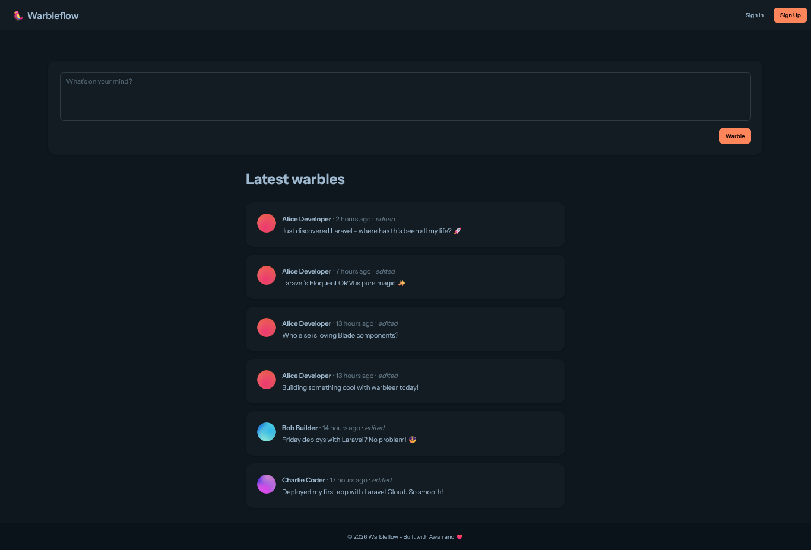
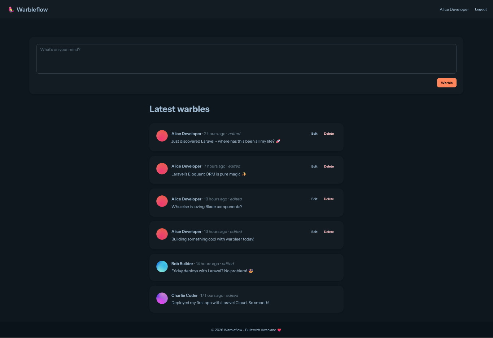
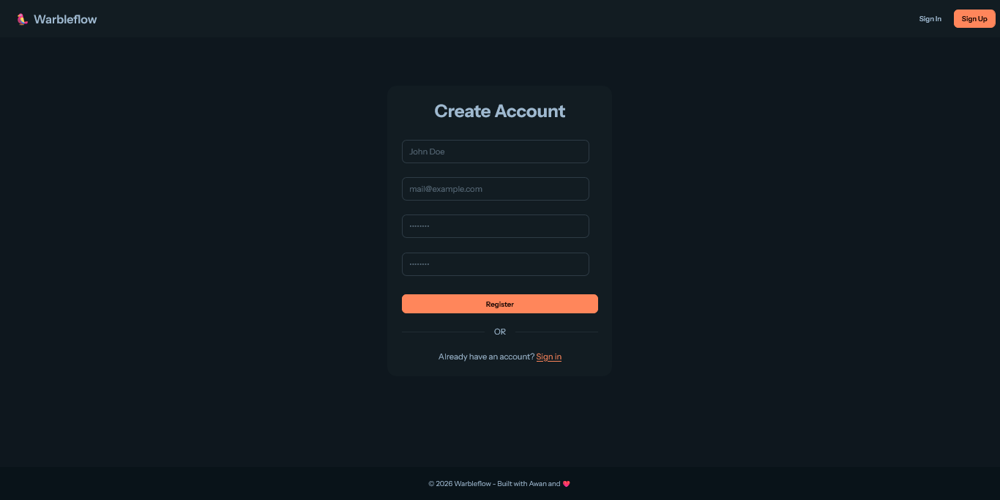
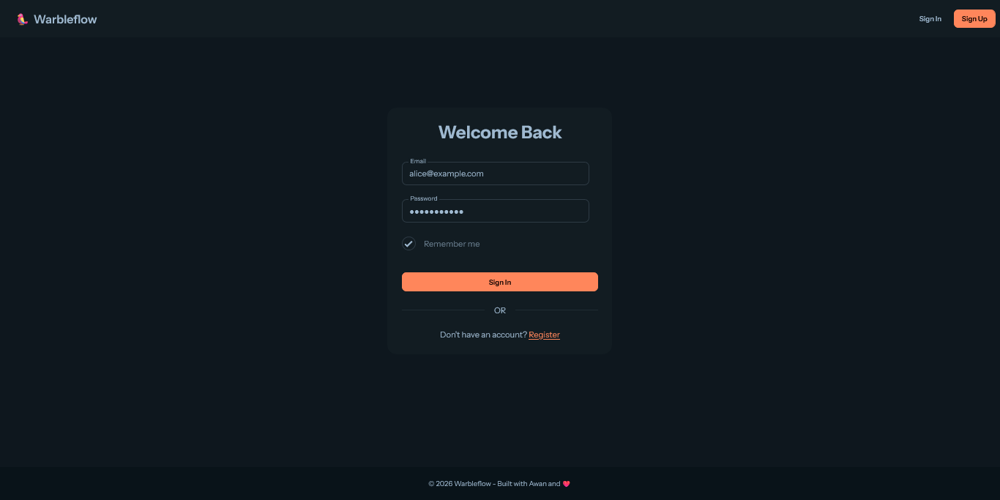

# Warbleflow

Warbleflow is a web project built to learn and practice web development using the Laravel 13 framework.


## Features

- Auth: Register, Login and Logout for user
- User can CRUD their warbles

## Tech Stack

- **Frontend:** HTML5, CSS3, TailwindCSS, DaisyUI, Blade
- **Backend:** PHP (Laravel)
- **Database:** MySQL 
- **Tools:** Git, WSL

## Screenshots

  
  
  
  


## Getting Started

Follow these simple steps to get a local copy up and running.

### Prerequisites

Make sure you have the following installed:
* Package Manager (npm / composer)
* Runtime Environment (Node.js / PHP)

### Installation

1. Clone the repository
```bash
   git clone git@github.com:soniawan/warbleflow.git
```
2. Navigate to the project directory
```bash
   cd your-repo-name
```
3. Install dependencies
```bash
   # For PHP & Laravel
   composer install

   # For nodejs
   npm install
```
4. Set up environment variables.
Create or edit a .env file in the root directory and add your configuration:
```bash
  DB_CONNECTION=mysql
  DB_HOST=127.0.0.1
  DB_PORT=3306
  DB_DATABASE=your_database_name
  DB_USERNAME=your_database_user
  DB_PASSWORD=your_database_password
```
5. Run migrations or start the development server
```bash
  # Run migration
  php artisan migrate

  # Run server
  composer run dev
```

## License

Distributed under the MIT License. See LICENSE for more information.
[](https://choosealicense.com/licenses/mit/)